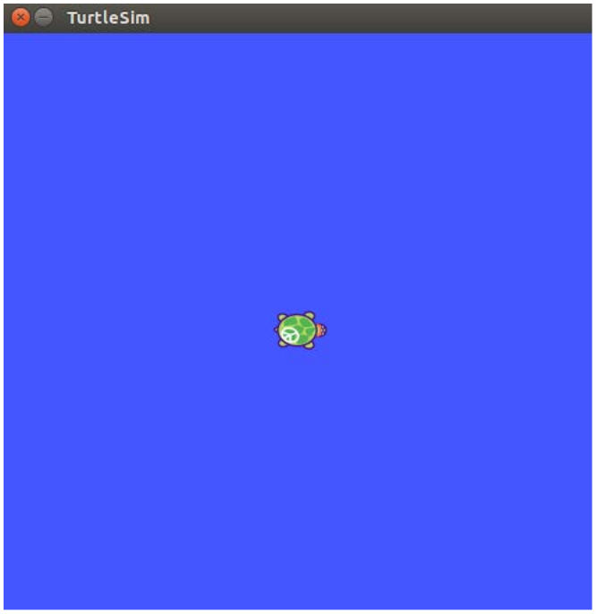
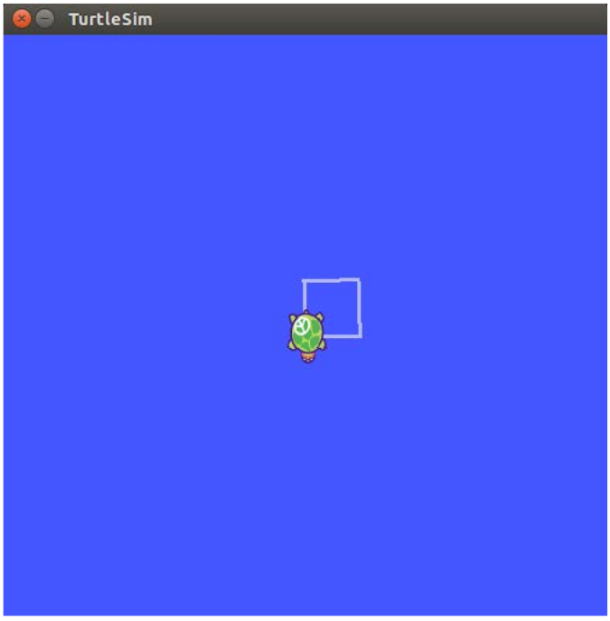

# turtlesim_pratice

## Overview
This ros package show how to publish velocity command and subscribe turtle position  
simultaneously so as to make turtle move square trajectory.

## Result
**start**
<tr>
<td>

</td>
</tr>

**end**
<tr>
<td>

</td>
</tr>

